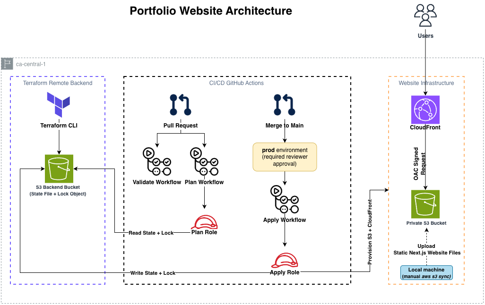

# Portfolio Website Deployment


This repository contains the Terraform code to deploy a static Next.js portfolio website on AWS using modern Infrastructure as Code (IaC) and security best practices.

Read the writeup on the initial infrastructure and design decisions: [Deploying a Next.js Portfolio with Terraform, S3, and CloudFront](https://medium.com/@samiashafique/from-project-brief-to-production-style-infrastructure-deploying-a-next-js-908f305a6253). The CI/CD pipeline added since then is covered in its own article series, linked in the [CI/CD Pipeline](#cicd-pipeline) section below.

## Project Overview
A freelance web designer required a secure, scalable, and cost-effective solution to host their modern single-page portfolio website built with Next.js. This project demonstrates how to:
1. Deploy a static Next.js website using Amazon S3.
2. Deliver content globally with Amazon CloudFront.
3. Secure the S3 bucket using Origin Access Control (OAC).
4. Block all public access to the S3 bucket.
5. Enable server-side encryption for objects stored in S3.
6. Manage AWS infrastructure using Terraform.
7. Store Terraform state remotely in Amazon S3, using Terraform's native S3 lockfile for state locking.
8. Validate and plan Terraform changes automatically on every pull request, then apply them on merge behind a manual approval gate, using GitHub Actions authenticated via short-lived OIDC credentials (no static AWS access keys).

## Architecture



## Prerequisites
-  Terraform CLI - https://developer.hashicorp.com/terraform/install
-  AWS CLI - https://docs.aws.amazon.com/cli/latest/userguide/getting-started-install.html
-  AWS Account with permissions to create S3, CloudFront, and IAM resources
-  Node.js and npm
-  GitHub repository variables named `AWS_PLAN_ROLE_ARN` and `AWS_APPLY_ROLE_ARN`, a GitHub Environment named `prod` with a required reviewer, and branch protection on `main` (see [Bootstrapping](#bootstrapping-the-remote-backend-and-ci-roles) below) if you want the CI workflows to run

## CI/CD Pipeline
Terraform changes flow through three GitHub Actions workflows. All three filter on `terraform/**`, so a change elsewhere in the repository doesn't burn a runner.

**1. Validate** — runs on pull requests, checks the config without touching AWS:
1. Checks Terraform formatting (`terraform fmt -check`)
2. Initializes Terraform without the remote backend (`terraform init -backend=false`)
3. Validates the configuration (`terraform validate`)

See the full writeup: [Infrastructure Delivery with GitHub Actions: Part 1](https://medium.com/@samiashafique/production-style-infrastructure-delivery-with-github-actions-part-1-validating-terraform-changes-bd9649f9704a).

**2. Plan** — runs on pull requests, shows the reviewer exactly what will change in AWS before the PR merges:
1. Assumes a read-only IAM role via GitHub OIDC (short-lived credentials, no stored secrets)
2. Initializes Terraform against the real S3 backend
3. Runs `terraform plan` and posts the result as a comment on the pull request, updating the same comment on subsequent pushes

See the full writeup: [Infrastructure Delivery with GitHub Actions: Part 2](https://medium.com/@samiashafique/infrastructure-delivery-with-github-actions-part-2-planning-terraform-changes-on-every-pull-fdbb8b5e91ad).

**3. Apply** — runs on merge to `main`, applies the change to AWS after a human approves:
1. Pauses at the `prod` GitHub Environment until a required reviewer approves. Nothing runs before that point — no checkout, no token, no credentials
2. Assumes a separate apply role via OIDC, distinct from the plan role and holding write permissions the plan role does not have
3. Runs `terraform apply -auto-approve` against the real backend

The two roles are deliberately separate. A single role would need one trust policy admitting both triggers, and the weaker of the two — `pull_request`, which runs code a contributor controls — would end up governing the strongest permissions. The apply role's trust policy pins the token audience, the `prod` environment and the `main` branch; all three must match before AWS issues credentials.

<!-- TODO: link Part 3 of the article series once published -->

**What this pipeline does not do.** It manages infrastructure, not content. The website files still reach S3 through `aws s3 sync` run by hand, so tearing the stack down and rebuilding it restores the bucket and the distribution but not the site. Automating that needs its own workflow and its own role — see [Future Improvements](#future-improvements).

## Bootstrapping the Remote Backend and CI Roles
Before initializing Terraform, create the remote backend that stores the Terraform state, and the two IAM roles the CI workflows assume via OIDC. Both are chicken-and-egg problems — CI can't create the roles it needs in order to run — so this part is applied manually, once, from your machine.

Keeping it manual is a deliberate choice rather than an unfinished one: a pipeline that could edit its own IAM would be able to widen its own permissions, which would make the approval gate decorative.

> **Note:** This project uses the **Canada (Central) (`ca-central-1`)** AWS Region. Replace `your-unique-backend-bucket-name` with a globally unique S3 bucket name and update `backend.tf` in both `terraform/` and `bootstrap/` accordingly.

### 1. Create the S3 bucket
```bash
aws s3api create-bucket \
  --bucket your-unique-backend-bucket-name \
  --region ca-central-1 \
  --create-bucket-configuration LocationConstraint=ca-central-1
```

### 2. Enable bucket versioning
```bash
aws s3api put-bucket-versioning \
  --bucket your-unique-backend-bucket-name \
  --versioning-configuration Status=Enabled
```

### 3. Enable server-side encryption
```bash
aws s3api put-bucket-encryption \
  --bucket your-unique-backend-bucket-name \
  --server-side-encryption-configuration '{
    "Rules": [
      {
        "ApplyServerSideEncryptionByDefault": {
          "SSEAlgorithm": "AES256"
        }
      }
    ]
  }'
```

State locking uses Terraform's native S3 lockfile support (`use_lockfile = true`) — no DynamoDB table is required.

### 4. Apply the bootstrap config
This creates the GitHub OIDC provider, the plan-only role (`bootstrap/plan-role.tf`) and the apply role (`bootstrap/apply-role.tf`):
```bash
cd bootstrap
terraform init
terraform apply
```

### 5. Configure the GitHub repository variables
Copy the role ARNs from the bootstrap apply and add them as repository variables so the workflows can assume them:
```bash
terraform output plan_role_arn
terraform output apply_role_arn
```
In GitHub: **Settings → Secrets and variables → Actions → Variables** → add `AWS_PLAN_ROLE_ARN` and `AWS_APPLY_ROLE_ARN` with those values.

A role ARN is an identifier, not a credential, which is why these are variables rather than secrets — knowing the ARN gets you nothing, because the trust policy is the control.

### 6. Create the `prod` environment
In GitHub: **Settings → Environments** → create an environment named exactly `prod` and add yourself as a required reviewer.

This is what pauses the apply workflow, and it is load-bearing for more than convenience. A job that declares an environment receives an OIDC token whose `sub` claim reads `repo:OWNER/REPO:environment:prod`, and the apply role's trust policy requires that exact string. A run that never passed the gate never gets a matching token, so the approval is enforced by AWS as well as by GitHub's UI. The name must match the trust policy exactly, including case.

### 7. Protect the `main` branch
In GitHub: **Settings → Rules → Rulesets** (or **Settings → Branches**) → require a pull request before merging to `main`.

Without this, a direct push to `main` triggers the apply workflow having skipped validation and plan entirely. The approval gate would still hold, but you would be approving a change no plan was ever produced for, and approving something you cannot see is not a review.

Once the backend resources exist and both roles are bootstrapped, update the S3 bucket name in `terraform/backend.tf` to match the bucket you created above. You can then continue with the deployment steps below.

## Steps to Deploy
These steps stand the project up the first time, from a machine with credentials. Once it is running, changes under `terraform/` go through a pull request and are applied by the pipeline on merge — see [CI/CD Pipeline](#cicd-pipeline).

### 1. Clone the repository
```bash
git clone https://github.com/samiashafique/terraform-portfolio-project.git
cd terraform-portfolio-project
```

### 2. Build the Next.js application
```bash
cd portfolio-website
npm install
npm run build
```
This generates a static version of the website in the `out` directory.

### 3. Initialize Terraform
```bash
cd ../terraform
terraform init
```

### 4. Review and deploy the infrastructure
```bash
terraform plan
terraform apply
```
Terraform provisions the following AWS resources:
- Amazon S3 bucket
- CloudFront distribution
- Origin Access Control (OAC)
- Bucket policy
- Bucket ownership controls
- Public access block
- Server-side encryption

### 5. Upload the website
```bash
aws s3 sync ../portfolio-website/out s3://your-website-bucket-name
```
> **Note:** Replace your-website-bucket-name with the S3 bucket name configured in terraform/main.tf.

This upload step stays manual. Terraform manages the bucket, not its contents, so the site has to be published separately after the infrastructure exists.

### 6. Access the website
Retrieve the CloudFront URL:
```bash
terraform output cloudfront_url
```
Open the CloudFront URL in your browser to view the deployed website.

## Security Best Practices Implemented
- Private Amazon S3 bucket
- CloudFront Origin Access Control (OAC)
- S3 Public Access Block enabled
- Bucket Ownership Controls
- Server-side encryption (AES256)
- HTTPS enforced through CloudFront
- Least-privilege bucket policy
- Remote Terraform state with native S3 state locking
- Short-lived OIDC credentials for CI (no static AWS access keys) — nothing long-lived is stored in GitHub
- Separate IAM roles for plan and apply, so the trigger that runs contributor-controlled code cannot reach the permissions that change infrastructure
- Plan role restricted to read-only plus a single-object S3 lock permission — no write access to actual infrastructure
- Apply role trust policy pins token audience, `prod` environment and `main` branch, all three required
- Apply role write permissions scoped by ARN wherever AWS supports it: bucket-level actions on the website bucket only, object writes limited to the two Terraform state keys, and delete limited to the lock file
- IAM roles managed in a separate bootstrap configuration that CI cannot apply, so the pipeline cannot grant itself permissions

## Future Improvements
* Automate the content deploy — build, `aws s3 sync` and CloudFront invalidation — in its own workflow with its own role, scoped to bucket objects and invalidations and holding no infrastructure permissions
* Scope both CI roles' read permissions from the actual API calls Terraform makes, instead of the broad `ReadOnlyAccess` managed policy currently attached to each
* Extend the validation workflow's `terraform/**` path filter to also cover `bootstrap/` — the most privileged configuration in the repository is currently the one CI never checks
* Adopt GitHub's immutable OIDC subject claims. This repository predates the 15 July 2026 default, so it still uses the name-based `sub` format; renaming or transferring the repository would switch it over and break both trust policies
* Refactor the configuration to use input variables instead of hardcoded values
